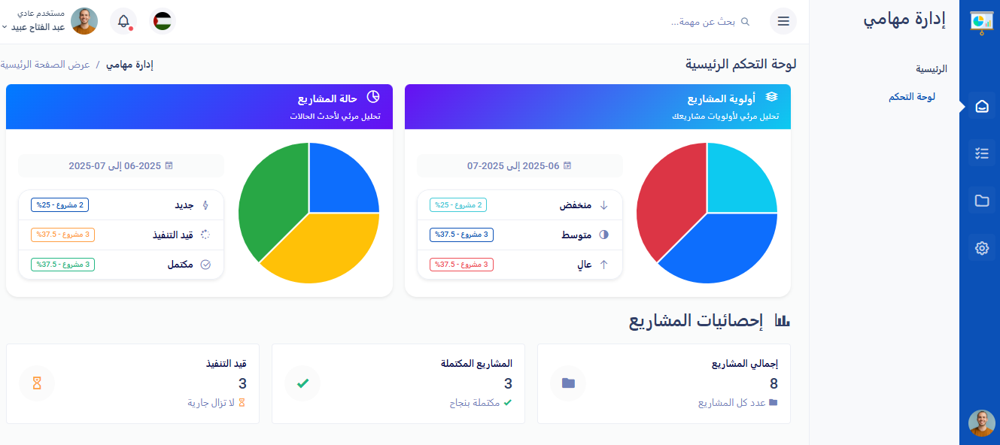
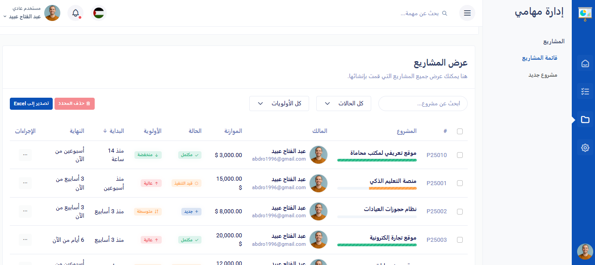

<h1 align="center">🚀 Task Management System – Built with Laravel & Livewire</h1>

<p align="center">
  
</p>

<p align="center">
  A modern Arabic-first task and project management platform built with <strong>Laravel 12</strong> and <strong>Livewire 3</strong>.  
  Fully responsive, RTL-supported, and packed with smart dashboard features for seamless task tracking.
</p>

---

## Screenshots

<p align="center">
  
  <br><small> Dashboard View</small>
</p>

<p align="center">
  
  <br><small>📂 Project List Page</small>
</p>

---

## ✨ Features

- Custom user dashboard with real-time stats  
- 📂 Project creation, status tracking & progress management  
- ✅ Task management per project: status, priority, deadlines  
- 📊 Dynamic charting for insights (progress, priority, budget)  
- 🌐 Full Arabic support with RTL layout  
- 📱 Fully responsive for mobile & tablets  
- 🔒 Secure with Laravel’s built-in authentication

---

## ⚙️ Tech Stack

| Tool / Technology | Description                         |
|------------------|-------------------------------------|
| Laravel 12       | PHP backend framework               |
| Livewire 3       | Reactive components without JS      |
| MySQL            | Database                            |
| Metrica Template | Responsive admin dashboard UI       |
| Bootstrap 5      | UI framework                        |
| Blade            | Laravel’s template engine           |

---

## Demo Credentials

## 🔐 Access the System

To try the system, please create a new account:

👉 [Register a new account](your-app-url/register)

*No demo credentials provided — you can explore all features by creating your own test account.*

---

## 🚀 Run the Project Locally

```bash
git clone https://github.com/abdulfatah1996/idarat-mahami.git
cd idarat-mahami

composer install
cp .env.example .env
php artisan key:generate
php artisan migrate --seed

php artisan serve
